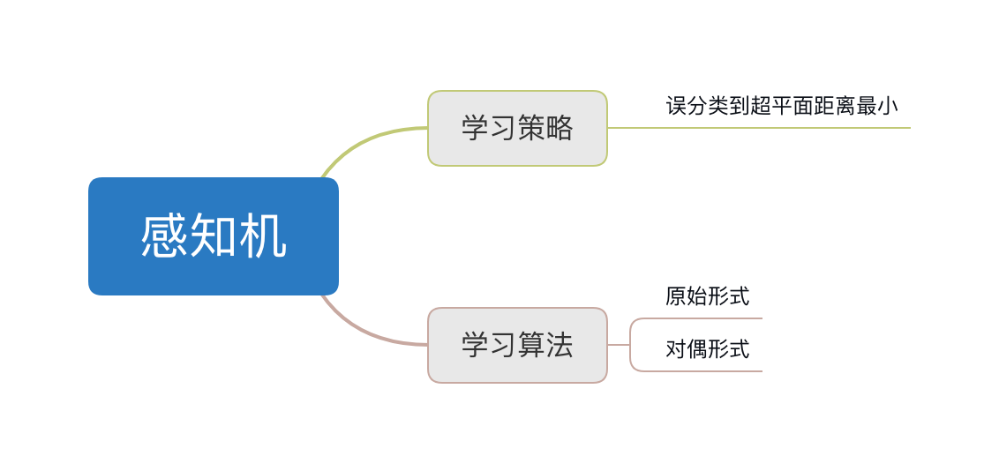
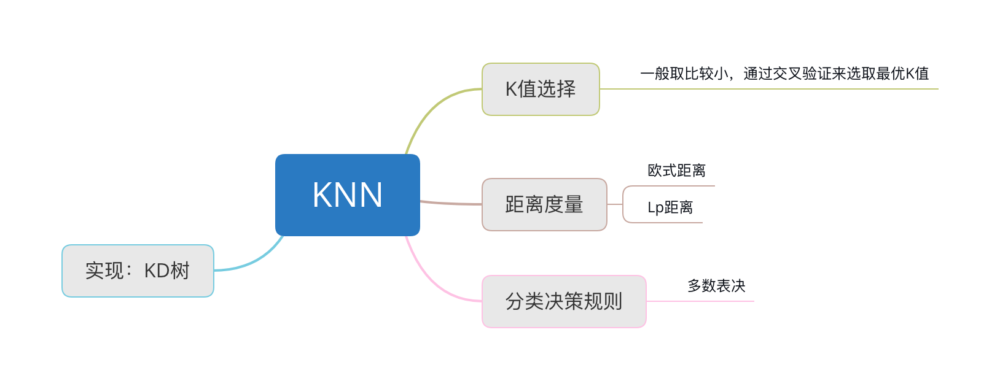

[toc]

# 统计学习方法概论

# 感知机

$$
f(x) = sign(w \cdot x + b) \\
\operatorname{sign}(x)=\left\{\begin{array}{l}+1, x \geq 0 \\ -1, x<0\end{array}\right.
$$

其中$w \cdot x + b = 0$是一个超平面，w是法向量，b是超平面截距，超平面将特征空间划为两部分。

## 损失函数

任意一点到超平面的距离=$\frac{1}{\|w\|}\left|w \bullet x_{0}+b\right|$, 因此损失函数不考虑$\|w\|$为(M为误分类点的集合)：
$$
L(w,b) = \sum_{x \in M} y_i(w \cdot x_{0}+b )
$$

## 学习算法

### 原始形式

使用随机梯度下降法，一次随机选取一个误分类点使其梯度下降（为啥？因为分正确没有损失，只有选错误的）。
$$
\begin{array}{l}\nabla_{w} L(w, b)=-\sum_{x_{i} \in M} y_{i} x_{i} \\ \nabla_{b} L(w, b)=-\sum_{x_{i} \in M} y_{i}\end{array}
$$
算法步骤：

输入：训练数据集 $T=\left\{\left(x_{1}, y_{1}\right),\left(x_{2}, y_{2}\right), \ldots,\left(x_{N}, y_{N}\right)\right\}$, 学习率$\eta$

输出：$w, b$

1. 选取初始值$w_0, b_0$

2. 训练集中随机选取数据$(x_i, y_i)$

3. 如果$y_i(w \cdot x_i + b) < 0$，更新参数：
   $$
   \left\{\begin{array}{l}w \leftarrow w + \eta y_i x_i \\ b \leftarrow b + \eta y_i \end{array}\right. \tag{1}
   $$

4. 转至步骤2，直到收敛。

## 对偶形式

根据梯度更新公式1，假设修改n次，那么w,b关于$x_i, y_i$的增量分别是$\alpha_i y_i x_i$和$\alpha_i y_i$，$\alpha_i = n_i \eta$其中$n_i$表示第i次更新是否是负样本，如果是，则为1。
$$
\begin{aligned} w &=\sum_{i=1}^{N} \alpha_i y_{i} x_{i} \\ b &=\sum_{i=1}^{N} \alpha_{i} y_{i} \end{aligned}
$$
所以对偶形式为：

输入：训练数据集 $T=\left\{\left(x_{1}, y_{1}\right),\left(x_{2}, y_{2}\right), \ldots,\left(x_{N}, y_{N}\right)\right\}$, 学习率$\eta$

输出：$\alpha, b$， 感知机模型：$f(x)=\operatorname{sign}\left(\sum_{j=1}^{N} \alpha_{j} y_{j} x_{j} \bullet x+b\right)$，其中$\alpha=\left(\alpha_{1}, \alpha_{2}, \ldots, \alpha_{N}\right)^{T}$

1. 选取初始值$\alpha \leftarrow 0, b \leftarrow 0$

2. 训练集中随机选取数据$(x_i, y_i)$

3. 如果$y_{i}\left(\sum_{j=1}^{N} \alpha_{j} y_{j} x_{j} \bullet x_{i}+b\right) \leq 0$，更新参数：
   $$
   \begin{array}{l}\alpha_{i} \leftarrow \alpha_{i}+\eta \\ b \leftarrow b+\eta y_{i}\end{array}
   $$
   
4. 转至步骤2，知道没有误分类数据

对偶形式中训练实例仅以内积的形式出现，为了方便，可以预先将训练集中实例间的内积计算出来并以矩阵形式存储，这个矩阵就是所谓的Gram矩阵(Gram matrix)
$$
G=\left[x_{i} \bullet x_{j}\right] M \times N
$$

> 比较好的一篇总结：https://zhuanlan.zhihu.com/p/30155870

# KNN

# 朴素贝叶斯

